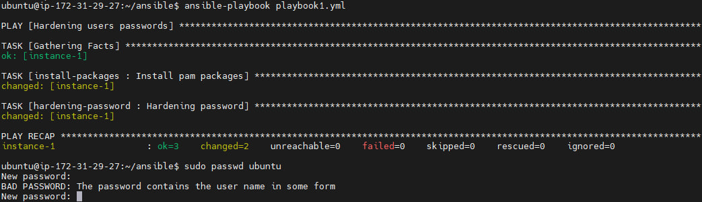
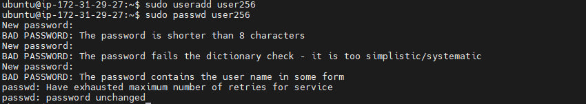

# Hometask-7/8-Hardening
*To complete this task:* 

* I created EC2 instance in AWS;
* Installed *ansible* on it;
* Created [inventory file](hosts.txt);
* Created [role for installing packages](install-packages/tasks);
* Created [role for hardening user's passwords](hardening-password/tasks);
* Created [ansible.cfg](ansible.cfg);
* Created [playbook](playbook1.yml) that hardens user's password.

## In order to execute this playbook You need to:
- Install ansible; 
- Clone [repository](https://github.com/victoriiastee/Hometask-7-Hardening);
- Enter and run: 
```
ansible-playbook playbook1.yml
```

# Results

I tried to set these attempts : 
'123' 
'12345678' 
'user256256' 

 
### Thank You!
